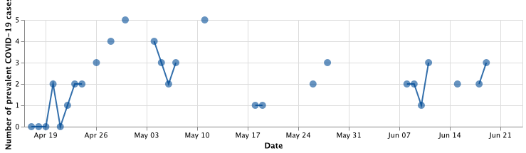

# About 

This repository contains code to reproduce all anayses in the manuscript 

> Maren Hackenberg, Marlon Grodd, Clemens Kreutz, Martina Fischer, Janina Esis, Linus Grabenhenrich, Christian Karagiannidis, Harald Binder: Using Differentiable Programming for Flexible Statistical Modeling 
> ([arXiv preprint](https://arxiv.org/abs/2012.05722)).

The repository is structured as follows: 

The main folder contains commented code scripts written in [Julia](https://julialang.org/) (the `.jl` files) to reproduce all results, tables and figures in the manuscript and the supplementary material. 

Specifically,
 - the script `01_ÌndividualModels.jl` reproduces the analysis in the correponding **Section 4.2 "Individual Models"** in the manuscript, including the individual results in **Table 1** and **Supplementary Figure 1**. 
 - the script `02_GlobalvsIndividualParameters.jl` reproduces the analysis in the corresponding **Section 4.3 "Global vs. individual parameters"** in the manuscript, including **Table 1**. 
 - the script `03_SensitivityAnalysis_IncidencesUpperLowerBound.jl` contains the analysis mentioned at the **beginning of Section 4.4 "Sensitivity Analysis"** in the manuscript, where we investigate the sensitivity of the model with respect to the predicted incidences by alternatively using the upper or lower bound of the maximum likelihood estimate of these predicted incidences as a covariate in our increment model. The script reproduces **Supplementary Tables 1 and 2**.
 - the script `04_SensitivityAnalysis_TemporalSubsets.jl` contains the code to fit the increment model on all temporal subsets of the entire dataset that are half as long as the complete time interval, for all combinations of global and invididual parameter combinations, respectively. The code is parallelized to lower runtime.
 - the script `05_SensitivitityAnalysis_EvaluateTemporalSubsets.jl` contains the code to evaluate the results on fitting model on the temporal subsets and reproduces the results presented in **Section 4.4 "Sensitivity Analysis"** in the manuscript, specifically **Table 2** and **Figure 2**, as well as **Supplementary Tables 3, 4 and 5**. 
 - the script `06_SensitivityAnalysis_RecoveringCensoredValues.jl` contains the code to reproduce the validation analyses reported in **Section 4.4 "Sensitivity Analysis"** in the manuscript, where we randomly censor varying proportions of reports from hospitals with complete reporting and evaluate the model performance in recovering them, also in comparison to the baseline models. The script reproduces **Supplementary Table 6**. 

To run the scripts, Julia has to be [downloaded](https://julialang.org/downloads/) and installed. The required packages and their versions are specific in the `Project.toml` and `Manifest.toml` files in the main folder and automatically loaded/installed at the beginning of each script. 

In the `src` folder, the source code of the model loss function can be found, as well as several convenience functions to set up the environment,  evaluate performance results, process and format the corresponding data frames, etc. These functions are automatically loaded in each script that uses them. 

The `results` subfolder contains all intermediate results, such as estimated coefficients from longer-running models, as well as the tables and figures created within the scripts. When running the scripts, all results are automatically saved to that subfolder. 

Additionally, in the `notebooks` subfolder, we provide a Jupyter notebook tutorial `IndividualModels+ExemplaryVisualization.ipynb` to serve as starting point for illustrating our method. It guides the user through exemplary analyses step by step and reproduces the individual results in Table 1 as well as Figures 1 and 2 in the manuscript. 
